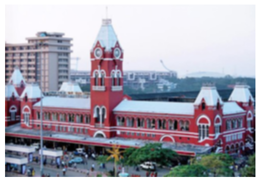
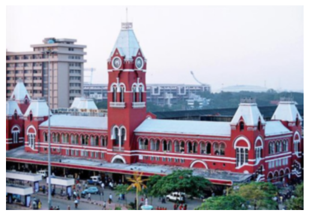
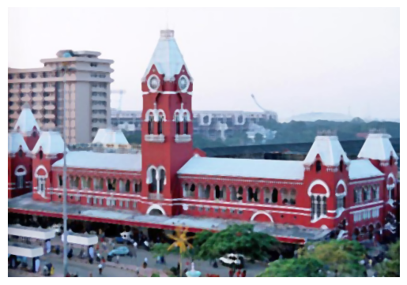
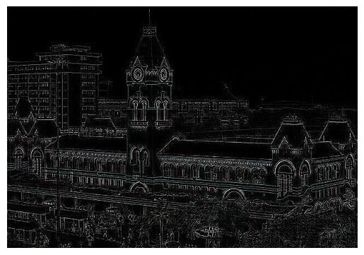
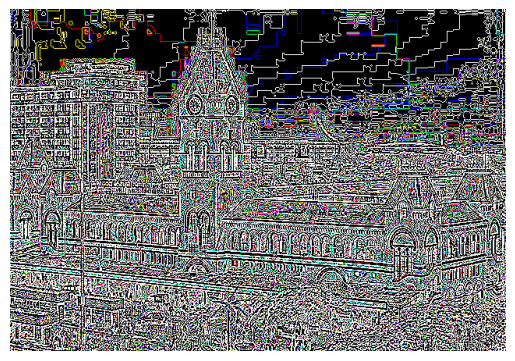

# Image Smoothing and Sharpening Using OpenCV

## Aim

To write a Python program using OpenCV to apply different smoothing filters (Averaging, Weighted Averaging, Gaussian, Median) and sharpening filters (Laplacian Kernel and Laplacian Operator) for image enhancement, and display each result separately along with the original image for comparison.

---

## The program performs the following operations:

- Read and display an input image  
- Apply Averaging filter  
- Apply Weighted Averaging filter  
- Apply Gaussian filter  
- Apply Median filter  
- Apply Laplacian sharpening using kernel  
- Apply Laplacian operator  
- Display all outputs for comparison  

---

##  Software Used

- Anaconda – Python 3.7  
- Jupyter Notebook / VS Code  
- OpenCV (cv2)  
- NumPy  
- Matplotlib  

---

##  Algorithm

### Step 1:
Import the required libraries: OpenCV, NumPy, and Matplotlib.

### Step 2:
Read the input image (e.g., `image.jpg`).

### Step 3:
Convert the image from BGR to RGB format for display.

### Step 4:
Apply Averaging Filter using `cv2.blur()`.

### Step 5:
Apply Weighted Averaging Filter using a custom kernel with `cv2.filter2D()`.

### Step 6:
Apply Gaussian Filter using `cv2.GaussianBlur()`.

### Step 7:
Apply Median Filter using `cv2.medianBlur()`.

### Step 8:
Apply Laplacian Sharpening using Kernel with `cv2.filter2D()`.

### Step 9:
Convert image to grayscale and apply Laplacian Operator using `cv2.Laplacian()`.

### Step 10:
Display all filtered images using a grid layout for comparison.

---
## Program:
</br>

###  Developed By: Ashqar Ahamed S T
### Register Number: 212224240018

### 1. Smoothing Filters

i) Using Averaging Filter

```Python
kernel = np.ones((5,5),np.float32)/25
avg_fil_img = cv2.filter2D(img,-1,kernel
```

ii) Using Weighted Averaging Filter

```Python
kernel = np.array([[1,2,1],[2,4,2],[1,2,1]],np.float32)/16
w_avg_fil_img = cv2.filter2D(img,-1,kernel)

```

iii) Using Gaussian Filter

```Python
gaussian_fil_img = cv2.GaussianBlur(img,(5,5),0)
```

iv)Using Median Filter

```Python
med_fil_img = cv2.medianBlur(img,5)
```

### 2. Sharpening Filters
i) Using Laplacian Linear Kernal
```Python

kernel = np.array([[0,1,0],[1,-4,1],[0,1,0]])
sharpening_fil_img = cv2.filter2D(img,-1,kernel)

```
ii) Using Laplacian Operator
```Python

laplacian_fil_img = cv2.Laplacian(img,cv2.CV_64F)

```

## OUTPUT:

### Smoothing Filters

- Averaging filter produces blurred image  
- Weighted averaging provides smoother result with less distortion  
- Gaussian filter preserves edges better while reducing noise  
- Median filter removes salt-and-pepper noise effectively  

###  Sharpening Filters

- Laplacian kernel enhances edges and fine details  
- Laplacian operator detects edges clearly in grayscale  


### 1. Smoothing Filters
</br>


i) Using Averaging Filter
</br>



ii)Using Weighted Averaging Filter
</br>


iii)Using Gaussian Filter
</br>



iv) Using Median Filter
</br>



### 2. Sharpening Filters
</br>

i) Using Laplacian Kernal
</br>



ii) Using Laplacian Operator
</br>



---


---

##  Result

Thus, smoothing filters and sharpening filters are successfully implemented using OpenCV.

The smoothing filters reduce noise and improve image quality, while sharpening filters enhance edges and details for better feature extraction.
